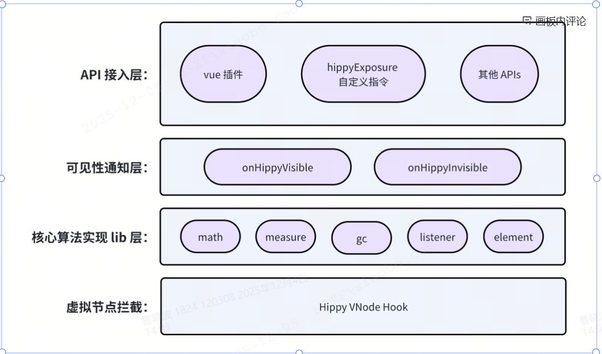

# Hippy Exposure SDK

<div align="center">

[](https://npm.msxf.com/package/@hippy/monitor)
[](LICENSE)
[](https://www.typescriptlang.org/)

**专为 Hippy 应用程序打造的高性能曝光解决方案**

*零侵入 · 插件化 · 高精度 · 易集成*

</div>

## 🚀 项目简介

**Hippy Exposure SDK** 是由应用平台研发团队-大前端小组精心打造的企业级 UI 元素曝光解决方案。基于插件化架构设计，为 Hippy 应用提供全方位、高精度的曝光检测能力。

### ✨ 核心特性

🔌 **无 Bridge 架构** - UI 元素的曝光检测发生在 JS 侧，无 Bridge 调用   
📊 **接口丰富** - 不仅支持了曝光 API，还提供了各种底层接口和事件，来实现更加个性化的业务能力。  
🎯 **高精度数据** - 提供详细的、精确的曝光数据，例如支持按照曝光比例来决定是否曝光。  
⚡ **性能无感知** - 内部针对 ScrollView 相关的检测，做了大量的算法优化，对性能的影响降到最低。  
🔧 **TypeScript 支持** - 完整的类型定义，优秀的开发体验。
## 📦 安装

### 环境

- Hippy-Vue 版本: 3.3.2+
- TypeScript: 5.2.2+ (可选)

## 1 快速接入

### 1.1 使用自定义指令在元素上绑定曝光数据
```html
<div v-hippy-exposure="data">
```
1. data 为空，不进行曝光
2. data 从空值 --变为--> 有值，会自动触发曝光检查

### 1.2 创建并注入插件，设置全局统一数据曝光入口函数

```ts
import exposure, { ExposurePluginFunction } from '@hippy/exposure';

// app 根节点 id: root
const exposurePlugin = exposure.createExposurePlugin('root', {
  visibleNotify: (el: HippyElement, data: NeedToType) => {
    if (data) {
      // data 为对应 el 绑定的曝光数据 (来自 v-hippy-exposure="data")
      // 当 el 曝光时，visibleNotify 会自动触发调用
      tracker.report(data)
    }
  }
});

app.use(exposurePlugin);
```
`visibleNotify`: 任何一个元素检测到曝光 (从不可见状态 -> 可见状态)，并且 data 有值，均会触发 visibleNotify 调用，这里可以很方便的对接到曝光埋点函数。进行统一处理。

### 1.3 设置容器 size，并启动插件执行
```ts
// hippy 的特性，存在整个页面还不可见，但 hippy 容器已经开始运行的情况
// 页面可见需要业务告知，所以，由业务启动曝光检测
nativeEmitter.on(NATIVE_EVENT_ENUM.PAGE_SHOW, () => {

  // pageShow 之后，才会开始触发曝光
  exposure.setPageShowStatus(true);

  if (exposure.isReady()) {
    // 每次 pageShow 事件，重新检测并上报需要曝光的组件，业务可选
    exposure.forceExposureForAllElement();
  } else {
    // hippy 无法通过 Native API 获取较为准确的容器大小，需要由业务精确告知
    // FUTURE: 如果未来有二级提额页(目前只有 tab)业务，需要这里加判断，设置不同的 size
    const size = SCREEN_SIZE;
    const containerSize = { width: size.width, height: size.height - TABBAR_HEIGHT };
    exposure.start(containerSize);
  }
});

// 整体页面不可见
nativeEmitter.on(NATIVE_EVENT_ENUM.PAGE_HIDE, () => {
  exposure.setPageShowStatus(false);
});
```
**重要:** 由于 hippy 工作在 Native 的一个 Page 容器中，所以需要严格对齐 Native 的 page_show 和 page_hide，在 page_show 中设置：exposure.setPageShowStatus(true); 让 SDK 知道是否需要执行曝光逻辑，然后调用 start 启动运行(执行一次即可)。在 page_hide 中设置exposure.setPageShowStatus(false);，当页面不可见时，SDK 会自动停止曝光追踪。  
start 需要传入整个 Hippy 外层容器的大小作为参数，建议通过 Bridge 查询客户端得到可靠的 Size 并传入，否则曝光可能不准确。

### 1.4 业务自行决定，是否需要在下拉刷新等事件后，主动曝光
```
// 下拉刷新，触发强制重新曝光检查
emitter.on(COMMON_EVENTS_ENUM.pageRefresh, triggerType => {
  if (triggerType === EFreshTriggerType.pullDown) {
    exposure.forceExposureForAllElement();
  }
});
```
如果业务需要在下拉刷新等场景，强制执行一次曝光，可以通过调用: exposure.forceExposureForAllElement() 来实现，SDK 内部会自动把当前在屏幕内的需要曝光的 UI 元素全部执行一遍 visibleNotify，触发曝光埋点数据上报。

### 1.5 相交比例控制曝光

1.2 中在创建插件的时，createExposurePlugin 支持 options 参数配置，createExposurePlugin 定义如下：
```ts
createExposurePlugin: (rootId: string, options?: ExposurePluginParam) => ExposurePluginFunction;
```
其中 rootId 为 dom 根节点的 id。options 为配置参数：
```ts
export interface ExposurePluginParam {
  // 因为滑动(或者重新布局)引发元素再次可见后，是否重复通知曝光，插件默认给 true
  reNotifyWhenReVisible?: boolean;
  exposureRatioThreshold?: number;
  isDebug?: boolean;
  visibleNotify?: ExposureVisibleCallback;
  invisibleNotify?: ExposureVisibleCallback;
}
```
- `reNotifyWhenReVisible?`: 一个已经曝光过的元素，又一次从不可见变为可见，是否需要通知曝光。默认: true
- `exposureRatioThreshold?`: 曝光比例门限值，表示 UI 元素漏出多少的面积比例后进行曝光，取值范围 [0.0, 1.0]。默认: 0.001，即少量的漏出，就会触发曝光。
- `isDebug?`: 用于调试。默认: false
- `visibleNotify?`：曝光回调函数，这里可以统一处理曝光埋点上报逻辑。
- `invisibleNotify?`：不可见回调函数  

普通使用：
```ts
// app 根节点 id: root
const exposurePlugin = exposure.createExposurePlugin('root', {
  visibleNotify: (el: HippyElement, data: NeedToType) => {
    if (data) {
      // data 为对应 el 绑定的曝光数据 (来自 v-hippy-exposure="data")
      // 当 el 曝光时，visibleNotify 会自动触发调用
      tracker.report(data)
    }
  }
});

app.use(exposurePlugin);
```
设置曝光比例：
```ts
// app 根节点 id: root
const exposurePlugin = exposure.createExposurePlugin('root', {
  exposureRatioThreshold: 0.2, // 漏出 20% 的时候，进行曝光，即回调 visibleNotify
  visibleNotify: (el: HippyElement, data: NeedToType) => {
    if (data) {
      // data 为对应 el 绑定的曝光数据 (来自 v-hippy-exposure="data")
      // 当 el 曝光时，visibleNotify 会自动触发调用
      tracker.report(data)
    }
  }
});

app.use(exposurePlugin);
```
## 2 自定义指令 & SDK 基本曝光逻辑

### 2.1 基本案例演示

```ts
// 普通用法
<div :collapsable="false" v-hippy-exposure="data"></div>
// 高级用法
<div :collapsable="false" v-hippy-exposure:[dataEnable]="data"></div>

// 1 使用 boolean 控制 enable
const dataEnable = ref(false);

// 2 使用 对象控制
const dataEnable = ref({
  enable: false
});
```
用于曝光的自定义指令所在的标签，建议使用:collapsable="false"，以防止被 hippy 优化掉。

### 2.2 自定义指令开关
1：支持 boolean 控制曝光开关
```ts
v-hippy-exposure:[enable]="data"
// enable 为 boolean 类型
```
2：支持对象类型，其中包含 enable，方便以后扩展
```ts

 v-hippy-exposure:[obj]="data"
 
 obj: { enable: boolean, ... }

```
其他情况，都不解析，直接返回 true，即默认上报数据。enable 和 data 任何一个发生变化，都会自动触发重新的曝光检查，如果可见且没有曝光过(isExposured 内部标记控制)，主动曝光一次。

### 2.3 曝光基本逻辑
被动的可见通知，必须满足以下 4 点：
* 元素从不可见状态 --转变为--> 可见状态 (sdk 内部算法自动检测)
* 自定义指令 dataEnable 检查
  * 未设置 dataEnable ，默认值为 true，即允许曝光
  * 设置了 dataEnable ，则检查 dataEnable 必须使用 boolean 类型，或者对象类型且包含 enable boolean 值。其他情况，不检测，直接放行，即 enable 为 true。 
    * 需要注意：dataEnable 从 false 变为 true，会强制检测曝光，不考虑上次是否曝光过
```ts
<div v-hippy-exposure:[dataEnable]="data"></div>

// 1 使用 boolean 控制 enable
const dataEnable = ref(false);

// 2 使用 对象控制，内部必须包含 enable 属性
const dataEnable = ref({
  enable: false
  // 其他值后续扩展
});

// 3 其他情况均不解析，直接放行，例如
<div v-hippy-exposure:enable="data"></div>
// sdk 不解析，直接认为是 true，继续进行曝光
```

* data 数据必须有值：
  1. data 为空，不进行曝光
  2. data 从空值 --变为--> 有值，会主动触发曝光检查
* SDK 内部会自动进行 isExposured 检查：检查之前是否曝光过，用来防止重复的无效曝光。  
  1. 例如 scrollView 滑动中，sdk 需要持续检查页面元素，有些元素会持续处于可见状态，此时通过 isExposured 避免重复的无效曝光通知。

### 2.4 哪些情况会重置曝光 isExposured
总结：从不可见状态 --转变为--> 可见状态 (内部会记录状态变化)，目前支持
1. 元素被滑动出屏幕后，又重新进入页面
2. 元素重新布局 或者 其他元素布局后，当前元素被迫挤出屏幕，然后下一次出现在屏幕

## 3 exposure 接口详细说明
### 2.1 接口定义
```ts
export interface ExposureInstance {
  createExposurePlugin: (rootId: string, options?: ExposurePluginParam) => ExposurePluginFunction;
  setPageShowStatus: (isShow: boolean) => void;
  start: (rootSize: Size) => void;
  isReady: () => boolean;
  setInvalid: (el: HippyElement, needDeepTraverse?: boolean) => void;
  trigger: (el: HippyElement, needDeepTraverse?: boolean) => void;
  forceExposureForAllElement: (checkEnable?: boolean) => void;
  forceExposureForElement: (elementId: number, checkEnable: boolean) => void;
  registCustomScrollComponents: (tags: string[]) => void;
  queryElementVisible: (nodeId: number) => boolean;
}
```

| 函数 | 说明 | 参数 | 返回值 |
| :--- | :--- | :--- | :--- |
| **createExposurePlugin** | 创建 vue 插件 | 1. `rootId`：传入 app 自己根 div 的 id<br>2. `options`：`ExposurePluginParam` 配置参数 | `ExposurePluginFunction` |
| **setPageShowStatus** | 设置页面可见状态，否则 SDK 会认为整个页面不可见，不会触发曝光回调。<br>- `page_show`：设置为 true<br>- `page_hide`：设置为 false | `status: boolean` | `void` |
| **isReady** | 判断 SDK 是否准备好 | 无 | `boolean` |
| **setInvalid** | 设置某个已经曝光过的节点失效，SDK 内部会把该节点标记为未曝光过，然后通过 trigger 立即触发重新曝光，或者等待下次 SDK 自动检测来曝光。 | 1. `el: HippyElement`：UI 元素节点，可通过 ref 获得。<br>2. `needDeepTraverse`：是否深度遍历，默认 false，设为 true 会对当前节点的所有子节点执行相同的失效逻辑。 | `void` |
| **trigger** | 用于主动触发曝光检测 | 1. `el: HippyElement`：UI 元素节点，可通过 ref 获得。<br>2. `needDeepTraverse`：是否深度遍历，默认 false，设为 true 会对当前节点的所有子节点执行相同的失效逻辑。 | `void` |
| **forceExposureForAllElement** | 强制触发所有需要曝光的元素重新进行曝光检查，符合曝光条件的都会重新调用 `visibleNotify` 通知业务。 | `checkEnable`：是否需要检查指令开关，默认值为 true。 | `void` |
| **forceExposureForElement** | 指定特定元素进行强制重曝光 | 1. `el: HippyElement`：元素 ID<br>2. `checkEnable: boolean`：是否需要检查指令开关，默认值为 true。 | `void` |
| **registCustomScrollComponents** | 暂时空实现，未来可注册自定义滑动组件的标签 | 暂无 | 暂无 |
| **queryElementVisible** | 主动检查某个元素是否可见，不会触发曝光通知，仅检查可见性。 | `el: HippyElement` | `boolean` |  

## 4 手动监听可见性事件 onHippyVisible \ onHippyInvisible
SDK 除了提供便捷的接入 API 外，额外提供 `onHippyVisible` \ `onHippyInvisible` 运行开发者自行监听某个元素的可见性，来实现个性化的曝光逻辑，或者其他能力。
SDK 提供的 API 层，也是基于 onHippyVisible \ onHippyInvisible 做的封装。
```ts
<div @hippyVisible="onVisible" @hippyInvisible="onInvisible"></div>

// 元素从不可见 变为 可见 (出现在屏幕范围内)
const onVisible = (e) => {
  // ...code
}

// 元素从可见 变为 不可见
const onInvisible = (e) => {
  // ...code
}
```
其中的回调参数 e:
```ts
e: {
  el: HippyElement,
  ratioInClipped: number, // 元素和裁剪区域的相交面积比例 (例如 scrollView)
  ratioInWindow: number,  // 元素和 window 的相交面积比例
}
```
注：如果同时实现了 `v-hippy-exposure` 自定义指令 和 `onHippyVisible`，会同时生效。

## 5 Swiper 曝光监听
Swiper 为 Hippy 提供的翻页滚动组件，该组件较为特殊，需要单独走一套曝光接入流程：
```ts
<swiper
    @swiperVisibleChanged="onSwiperVisibleChanged"
    @swiperInvisibleChanged="onSwiperInvisibleChanged"
 >
   <swiper-slide
        class="swiper-slide-item"
        v-for="(item, index) in data"
        :key="item[props.uniqueKey]"
      >
      <div></div>
    </swiper-slide>
</swiper>
```

SDK 为 swiper 单独提供了：
- onSwiperVisibleChanged 回调事件：swiper内部元素可见性发生变化
- swiperInvisibleChanged 回调事件：swiper内部元素不可见性发生变化

示例代码: 
```ts
// hippy-exposure sdk 发出的可见性通知
const onSwiperVisibleChanged = (e: SwiperExposureEvent) => {
  // 根据索引获取数据
  const exposuredData = data[e.index];
  tracker.track(exposuredData);
}

// hippy-exposure sdk 发出的不可见性通知
const onSwiperInvisibleChanged = (e: SwiperExposureEvent) => {
  // your code
}
```

回调事件：SwiperExposureEvent 
```ts
export interface SwiperExposureEvent {
  $swiperSlide: HippyElement; // 具体的(不)可见的 swiper-slide 元素
  isVisible: boolean;         // 是否可见
  index: number;              // swiper-slide 的索引
}
```

## 架构图



## 🤝 贡献

我们欢迎社区贡献！请参考以下指南：

### 提交规范

- 🐛 **fix**: 修复 bug
- ✨ **feat**: 新增功能
- 📝 **docs**: 文档更新
- 🎨 **style**: 代码格式调整
- ♻️ **refactor**: 代码重构
- ⚡ **perf**: 性能优化
- ✅ **test**: 测试相关
- 🔧 **chore**: 构建工具或依赖更新

## 👥 开发团队

### 核心维护者

  - 📧 xiaobo.cao
  - 🔗 主要贡献：项目架构设计、核心功能开发


## 📄 许可证

本项目采用 [MIT 许可证](LICENSE)。

## 🔗 相关链接

- 🌐 **[Hippy 官网](https://hippyjs.org/)** - Hippy 跨端开发框架

</div>